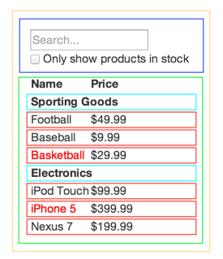

# React 编程思想

by Pete Hunt

在我看来，React 是构建大型，快速 Web app 的首选方式。它已经在 Facebook 和 Instagram 被我们有了广泛的应用。

React 许多优秀的部分之一，是它使得你在构建 app 的过程中不断思考。在本文里，我将带你经历一次使用 React 构建可搜索的商品数据表的思考过程。

## 从模型（mock）开始

想象我们已经有个一个 JSON API 和一个来自设计师的模型。我们的设计师显然做得不够好，因为模型看起来像这样：


我们的 JSON API 返回一些看起来像这样的数据：

```
[
  {category: "Sporting Goods", price: "$49.99", stocked: true, name: "Football"},
  {category: "Sporting Goods", price: "$9.99", stocked: true, name: "Baseball"},
  {category: "Sporting Goods", price: "$29.99", stocked: false, name: "Basketball"},
  {category: "Electronics", price: "$99.99", stocked: true, name: "iPod Touch"},
  {category: "Electronics", price: "$399.99", stocked: false, name: "iPhone 5"},
  {category: "Electronics", price: "$199.99", stocked: true, name: "Nexus 7"}
];
```

## 第一步：把UI拆分为一个组件的层级

首先你想要做的，是在模型里的每一个组件周围绘制边框，并给它们命名。如果你和设计师一起工作，他们应该已经完成这步了，所以去和他们谈谈！他们的 Photoshop 图层名也许最终会成为你的 React 组件名。

但是你如何知道什么东西应该是独立的组件？只需在你创建一个函数或者对象时，根据是否使用过相同技术来做决定。一种这样的技术是[单一功能原则（single responsibility principle）](https://en.wikipedia.org/wiki/Single_responsibility_principle)，也就是一个组件在理想情况下只做一件事情。如果它最终增长了，它就应该被分解为更小的组件。

既然你频繁显示一个 JSON 的数据模型给用户，你会发现，如果你的模型构建正确，你的 UI（因此也有你的组件结构）就将映射良好。那是因为 UI 和数据模型趋向附着于相同的 *信息架构*，这意味着，把你的 UI 分离为组件的工作通常是琐碎的，只需把 UI 拆分成能准确对应数据模型的每块组件。



在这里你会看到，在我们的简单 APP 里有五个组件。我用斜体表示每个组件的数据。

  1. **`FilterableProductTable` (橙色):** 包含示例的整体
  2. **`SearchBar` (蓝色):**  接收所有 *用户输入*
  3. **`ProductTable` (绿色):** 基于 *用户输入* 显示和过滤 *数据集合(data collection)*
  4. **`ProductCategoryRow` (蓝绿色):** 为每个 *分类* 显示一个列表头
  5. **`ProductRow` (红色):** 为每个 *商品* 显示一行

如果你看着 `ProductTable`，你会看到表头(包含了 "Name" 和 "Price" 标签) 不是独立的组件。这是一个个人喜好问题，并且无论采用哪种方式都有争论。对于这个例子，我把它留做 `ProductTable` 的一部分，因为它是 *data collection*渲染的一部分，而 *data collection* 渲染是 `ProductTable` 的职责。然而，当列表头增长到复杂的时候(例如 如果我们添加排序功能)，那么使它成为独立的 `ProductTableHeader` 组件无疑是有意义的。

既然现在我们已经识别出了我们模型中的组件，让我们把他们安排到一个层级中。这很容易。在模型中，出现在一个组件里面的另一组件 ，应该在层级中表现为一种子级关系：

  * `FilterableProductTable`
    * `SearchBar`
    * `ProductTable`
      * `ProductCategoryRow`
      * `ProductRow`

## 第二步：用React创建一个静态版本

<iframe width="100%" height="600" src="https://jsfiddle.net/reactjs/yun1vgqb/embedded/" allowfullscreen="allowfullscreen" frameborder="0"></iframe>

既然你已经有了你的组件层级，是时候实现你的app了。简单的方式是构建一个版本，它取走你的数据模型并渲染UI，除了没有互动性。这是将过程解耦的最好办法，因为构建一个静态版本需要不假思索地写很多代码，而添加互动性需要很多思考但不需要太多代码。之后我们将会看到原因。

要构建一个静态版本 app 来渲染你的数据模型，你将会想到构建一个重用其它组件并利用 *props* 传递数据的组件。*props* 是一种从父级传递数据到子级的方式。如果你对 *state* 的观念很熟悉，**绝不要用state** 来构建这个静态版本。State 仅仅是为互动性，也就是随时间变化的数据所预留的。由于这是一个静态版本，你还不需要用到它。

你可以自顶向下或自底向上的构建。也就是说，你可以既从较高的层级（比如从 `FilterableProductTable` 开始）也可以从较低的层级（`ProductRow`）开始构建组件。在较简单的例子里，通常自顶向下要容易一些，然而在更大的项目上，自底向上地构建更容易，并且更方便伴随着构建写测试。

在这一步的最后，你会获得一个渲染数据模型的可重用组件库。这些组件只有 `render()` 方法，因为这是一个静态版本。在层级顶端的组件 (`FilterableProductTable`) 将会接受你的数据模型，并将其作为一个prop。如果你改变了底层数据模型，并且再次调用 `React.render()` ，UI 将会更新。你可以很容易地看到 UI 是如何更新的，以及哪里变动了，因为这没什么复杂的。React的 **单向数据流** (也被称为 *单向绑定*)使一切保持了模块化和快速。

如果你在执行这步时需要帮助，请参阅 [React 文档](/react/docs/)。

### 小插曲: props vs state

在React里有两种数据 "模型": props 和 state。明白这二者之间的区别是很重要的；如果你不是很确定它们之间的区别，请概览[React官方文档](./interactivity-and-dynamic-uis.md)

## 第三步：确定最小（但完备）的 UI state 表达

要让你的 UI 互动，你需要做到触发底层数据模型发生变化。React用 **state** 来让此变得容易。

要正确的构建你的 app，你首先需要思考你的 app 需要的可变 state 的最小组。这里的关键是 DRY 原则：*Don't Repeat Yourself(不要重复自己)*。想出哪些是你的应用需要的绝对最小 state 表达，并按需计算其他任何数据。例如，如果你要构建一个 TODO list，只要保持一个 TODO 项的数组；不要为了计数保持一个单独的 state 变量。当你想渲染 TODO 的计数时，简单的采用 TODO 项目的数组长度作为替代。

考虑我们示例应用中的数据所有块，包括：

  * 原始的商品列表
  * 用户输入的搜索文本
  * 复选框的值
  * 商品的过滤列表

让我们逐个检查出哪一个是state，只需要简单地问以下三个问题:

  1. 它是通过props从父级传递来的吗？如果是，它可能不是 state。
  2. 它随时间变化吗？如果不是,它可能不是 state。
  3. 你能基于其他任何组件里的 state 或者 props 计算出它吗？如果是,它可能不是state.

原始的商品列表以 props 传入，所以它不是 state。搜索文本和复选框看起来是 state，因为他们随时间变化并且不能从任何东西计算出。最后，过滤出的商品列表不是 state，因为它可以通过原始列表与搜索文本及复选框的值组合计算得出。

所以最后,我们的 state 是:

  * 用户输入的搜索文本
  * checkbox 的值

## 第四步：确定你的 state 应该存在于哪里

<iframe width="100%" height="600" src="https://jsfiddle.net/reactjs/zafjbw1e/embedded/" allowfullscreen="allowfullscreen" frameborder="0"></iframe>

OK，我们已经确定好应用的最小 state 集合是什么。接下来，我们需要确定哪个组件可以改变，或者 *拥有* 这个state.

记住：React 总是在组件层级中单向数据流动的。可能不能立刻明白哪些组件应该拥有哪些 state。 **这对于新手在理解上经常是最具挑战的一部分，** 所以跟着这几步来弄明白它：

对于你的应用里每一个数据块：

  * 确定哪些组件要基于 state 来渲染内容。
  * 找到一个共同的拥有者组件（在所有需要这个state组件的层次之上，找出共有的单一组件）。
  * 要么是共同拥有者，要么是其他在层级里更高级的组件应该拥有这个state。
  * 如果你不能找到一个组件让其可以有意义地拥有这个 state，可以简单地创建一个新的组件 hold 住这个state，并把它添加到比共同拥有者组件更高的层级上。

让我们使用这个策略浏览一遍我们的应用：

  * `ProductTable` 需要基于 state 过滤产品列表，`SearchBar` 需要显示搜索文本和选择状态。
  * 共同拥有者组件是 `FilterableProductTable`。
  * 对于过滤文本和选择框值存在于 `FilterableProductTable`，从概念上讲是有意义的。

酷，我们已经决定了我们的 state 存在于 `FilterableProductTable`。首先，添加一个 `getInitialState()` 方法到  `FilterableProductTable`，返回 `{filterText: '', inStockOnly: false}` 来反映应用的初始状态。然后，传递`filterText` 和 `inStockOnly` 给 `ProductTable` 和 `SearchBar` 作为 prop。最后，使用这些 prop 来过滤 `ProductTable` 中的行和设置 `SearchBar` 的表单项的值。

你可以开始看看你的应用将有怎样的行为了: 设置 `filterText` 为 `"ball"` 并刷新你的 app。你将可以看到数据表被正确地更新。

## 第五步：添加反向数据流

<iframe width="100%" height="600" src="https://jsfiddle.net/reactjs/n47gckhr/embedded/" allowfullscreen="allowfullscreen" frameborder="0"></iframe>

到目前为止，我们已经构建了一个应用, 它以 props 和 state 沿着层级向下流动的功能正确渲染。现在是时候支持另一种数据流动了：在层级深处的表单组件需要更新 `FilterableProductTable` 里的 state。

React 让数据显式流动，使你理解应用如何工作变得简单，但是相对于传统的双向数据绑定，确实需要多打一些字。React 提供了一个叫做 `ReactLink` 的插件来使这种模式和双向数据绑定一样方便，但是考虑到这篇文章的目的，我们将会保持所有东西都直截了当。

如果你尝试在当前版本的示例中输入或者选中复选框，你会发现 React 忽略了你的输入。这是有意的，因为我们已经设置了 `input` 的 `value` prop 值总是与 `FilterableProductTable` 传递过来的 `state` 一致。

让我们思考下希望发生什么。我们想确保每当用户改变表单，就通过更新 state 来反映用户的输入。由于组件应该只更新自己拥有的 state ， `FilterableProductTable` 将会传递一个回调函数给 `SearchBar` ，每当 state 应被更新时回调函数就会被调用。我们可以使用 input 的 `onChange` 事件来接受它的通知。 `FilterableProductTable` 传递的回调函数将会调用 `setState()` ，然后应用将会被更新。

虽然这听起来复杂，但是实际上只是数行代码。并且这明确显示出了数据在应用中从始至终是如何流动的。

## 好了，就是这样

希望这给了你一个怎样思考用React构建组件和应用的概念。虽然可能比你过往的习惯要多敲一点代码，但记住，读代码的时间远比写代码的时间多，并且阅读这种模块化的、显式的代码是极为容易的。当你开始构建大型组件库时，你会非常感激这种清晰性和模块化，并且随着代码的重用，你的代码行数将会开始缩减。:)
